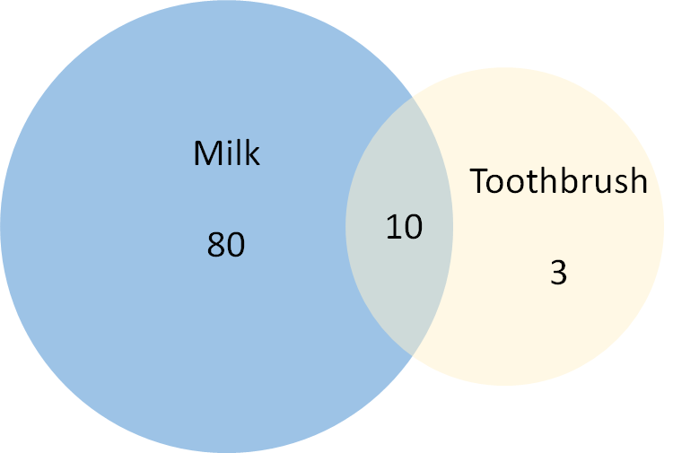
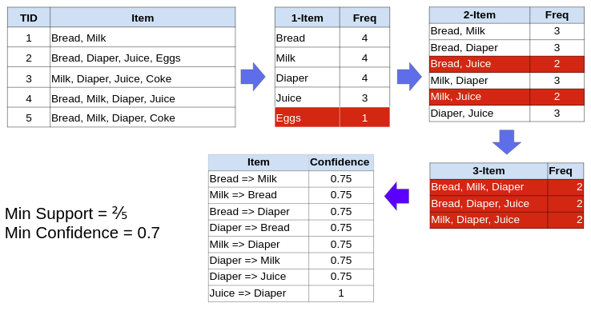

# Pengantar

**Association Rules** atau sering juga disebut dengan *Market Basket
Analysis (MBA)* merupakan kegiatan mencari aturan (rules) asosiasi yang
menunjukkan hubungan antar item dalam sebuah transaksi. Misalnya, ketika
seseorang membeli roti, maka orang itu cenderung akan membeli selai
juga. Misalnya lagi apabila kita membeli sikat gigi, maka kita cendrung
juga akan membeli pasta giginya. Pola-pola seperti ini akan sangat
bermanfaat dalam industri retail seperti dalam hal penetapan diskon
produk, promo, penjualan dalam bentuk paket, rekomendasi produk atau
penentuan lokasi dari item produk. Association Rules bisa juga
diterapkan dalam bidang kesehatan, misalnya untuk mendapatkan hubungan
dan interaksi antar faktor resiko seseorang dengan kecenderungan
penyakit yang muncul. Dalam bidang manufaktur dapat digunakan untuk
mencari pola hubungan antara parameter-parameter proses produksi dengan
potensi permasalahan kualitas produk, atau mencari pola-pola desain
produk yang diinginkan oleh pelanggan sehingga dapat dijadikan dasar
dalam mendesain sebuah produk yang baru.

Terdapat beberapa algoritma atau metode untuk menemukan rules, salah
satu yang paling populer adalah **Algoritma Apriori**. Association rules
atau aturan asosiasi yang dihasilkan nantinya akan memiliki bentuk
sebagai berikut: $$A => B$$

Berdasarkan rumus di atas, A adalah *antecedent* atau pendahulu
sedangkan B adalah *consequent* atau akibat. Cara membaca rumus di atas
adalah jika seseorang membeli item A, maka ada kecenderungan dia juga
akan membeli item B. Antecedent dapat berisi satu atau lebih item yang
menjadi penanda bahwa ketika kita sudah tahu dia membeli item tersebut
maka dia juga akan membeli item consequent. Bentuk hubungan ini tidak
bersifat kausalitas atau sebab akibat, tetapi berbentuk co-occurence
atau terjadi saling bersamaan.

## Association Rules Metrics

Sebelum masuk ke dalam penjelasan tentang algoritme apriori, pertama
kita harus mengetahui dahulu metrik atau tolak ukur yang digunakan dalam
association rules, yang meliputi *Support*, *Confidence*, dan *Lift*.

Sebagai ilustrasi, kita akan menggunakan data buatan yang berisi 5
transaksi sebagai berikut:

```{r}
df_dummy <- data.frame(transaction_id = 1:5,
                       items = c("soft drink, mineral water", 
                                 "soft drink", 
                                 "coffee, mineral water, lemon tea",
                                 "bread, coffee, mineral water",
                                 "coffee, mineral water"))

df_dummy
```

### Support

*Support* menunjukkan proporsi dari jumlah transaksi yang memiliki satu
atau lebih item yang muncul secara bersamaan dibandingkan dengan jumlah
transaksi secara keseluruhan. Rumus untuk menghitung *Support* dari
suatu item adalah sebagai berikut:

$$Support(B) = \frac{Jumlah\ transaksi\ yang\ berisi\ item\ B }{Jumlah\ seluruh\ transaksi} = \frac{Freq(B)}{N}$$

Berdasarkan data transaksi sebelumnya, maka *Support* untuk item
`soft drink` adalah sebagai berikut.

$$Support(soft\ drink) =  \frac{2}{5} = 0.4$$ Artinya 40% dari total
transaksi mengandung item soft drink.

Jika itemnya lebih dari satu, maka rumusnya menjadi seperti berikut:

$$Support(A,B) = \frac{Jumlah\ transaksi\ yang\ berisi\ item\ A\ \&\ B }{Jumlah\ seluruh\ transaksi} = \frac{Freq(A \cup B)}{N}$$
Berdasarkan data transaksi `df_dummy` sebelumnya, maka *Support* untuk
item `coffee` dan `mineral water` adalah sebagai berikut.

$$Support(coffee, mineral\ water) =  \frac{3}{5} = 0.6$$ Artinya 60%
dari total transaksi mengandung item coffee dan mineral water.

### Confidence

Jika *Support* hanya menunjukkan seberapa banyak proporsi sebuah item di
seluruh transaksi, maka *Confidence* menunjukkan **seberapa besar
kemungkinan seseorang akan membeli item B jika terdapat item A**, atau
setara dengan berapa banyak jumlah transaksi yang memiliki item A dan
item B diantara transaksi-transaksi yang memiliki item A. Rumus untuk
menghitung *Confidence* adalah sebagai berikut:

$$Confidence(A => B) = \frac{Freq(A\ \cap\ B)}{Freq(A)}$$ Berdasarkan
data transaksi sebelumnya, maka *Confidence* untuk item `coffee` dan
`mineral water` adalah sebagai berikut:

$$Confidence(mineral\ water => coffee) =  \frac{3}{4} = 0.75$$

Confidence(mineral water =\> coffee) menunjukkan rules/aturan jika
seseorang membeli mineral water, berapa kemungkinannya dia juga membeli
coffee. Maka, kita perlu mencari ada berapa transaksi yang terdapat item
mineral water dan coffee dan dibagi dengan seluruh transaksi yang di
dalamnya terdapat mineral water. Dari total 5 transaksi yang ada, 4 di
antaranya terdapat item mineral water dan dari 4 transaksi tersebut
terdapat 3 transaksi yang memiliki coffee maupun mineral water, sehingga
nilai Confidence(mineral water =\> coffee) adalah 3 dari 4 transaksi
atau sama degan 75%. Maka, ketika seseorang membeli mineral water,
kemungkinan seseorang membeli juga coffee adalah sekitar 75%.

Kelemahan dari *Confidence* adalah hanya mempertimbangkan seberapa
banyak/populer item A saja (perhatikan bagian penyebut) dan tidak
memperhatikan seberapa populer item B dalam seluruh transaksi.
Perhatikan ilustrasi menggunakan diagram Venn berikut:

```{r echo=FALSE}

```

Berdasarkan gambar di atas, terdapat 80 transaksi yang berisi Milk dan
13 transaksi berisi Toothbrush. Selain itu, terdapat 10 transaksi di
mana terdapat Milk dan Toothbrush. Jika kita memiliki rules bahwa
Toothbrush =\> Milk, maka Confidence-nya adalah:

$$Confidence(Toothbrush => Milk) = \frac{10}{13} = 76.9\%$$ Ketika
seseorang membeli Toothbrush maka ada kemungkinan 76.9% dia juga akan
membeli Milk. Sekilas mungkin masuk akal, tetapi bila diperhatikan, Milk
memiliki jumlah transaksi yang besar dan hanya sedikit dari transaksi
tersebut yang berkaitan dengan Toothbrush. Karena item Milk sangat
populer, maka wajar jika transaksi konsumen yang membeli Toothbrush juga
akan cenderung membeli Milk, sehingga meningkatkan nilai
*Confidence*-nya. Solusi untuk mengatasi hal ini, terdapat satu metrik
lagi yang menggunakan informasi dari antecedent dan precedent, yakni
**Lift** yang akan dibahas di sub-bab berikutnya.

### Lift

*Lift*, sesuai namanya, menunjukkan seberapa baik sebuah antecedent
"mengangkat" atau meningkatkan peluang seseorang membeli item
consequent. Jika *Confidence* hanya mengukur seberapa besar peluang
untuk membeli item B jika diketahui item A dibeli, maka Lift mengukur
seberapa besar pembelian item A meningkatkan peluang pembelian item B.
Rumus untuk menghitung Lift adalah sebagai berikut:

$$Lift(A,B) = \frac{Support(A,B)}{Support(A)\ Support(B)}$$ Berdasarkan
data transaksi sebelumnya, maka Lift untuk item `coffee` dan
`mineral water` adalah sebagai berikut.

Pertama, kita hitung terlebih dahulu nilai dari masing-masing *Support*
yang dibutuhkan.

$$Support(mineral\ water, coffee) =  \frac{3}{5} = 0.6$$

$$Support(mineral\ water) =  \frac{4}{5} = 0.8$$

$$Support(coffee) =  \frac{3}{5} = 0.6$$

Setelah mendapatkan semua nilai *Support*, kemudian masukkan nilai
*Support* yang diperoleh ke dalam rumus untuk mendapatkan nilai *Lift*
dari `mineral water => coffee`.

$$Lift(mineral\ water => coffee) = \frac{0.6}{0.6\ 0.8} = 1.25$$

Didapatkan nilai Lift(mineral water =\> coffee) = 1.25. Bagaimana cara
menginterpretasikannya? *Lift* membandingkan peluang ketika keberadaan
item satu menjadi sinyal kuat bahwa item lain juga akan dibeli dengan
peluang bahwa keberadaan item satu dengan lainnya saling independen dan
tidak berkaitan, sehingga:

-   Jika nilai Lift = 1, maka kedua item bersifat independen satu sama
    lain (tidak ada rules yang terbentuk).
-   Ketika nilai Lift \> 1, maka dapat kita katakan bahwa keberadaan
    mineral water meningkatkan peluang bahwa seseorang juga membeli
    coffee.
-   Jika nilai Lift \< 1, maka pembelian mineral water malah menurunkan
    peluang bahwa seseorang juga akan membeli coffee.

## Algoritma Apriori

Algoritma yang umum digunakan untuk membuat association rules adalah
*Apriori Algorithm*. Berikut merupakan cara kerja Apriori secara umum:

1.  Menentukan nilai minimum *Support* dan minimum *Confidence*\
2.  Membuat itemsets dari daftar item yang ada
3.  Membandingkan support dari itemsets tersebut dengan *minimum
    Support*, apabila nilai *support* dari suatu item dibawah *minimum
    support* maka itemsets tersebut dibuang atau tidak dibuat
    rules-nya.\
4.  Membandingkan antara minimum *Confidence* dengan *Confidence* dari
    rules yang telah memenuhi *minimum support*. Hanya ambil rules yang
    memiliki *Confidence* lebih tinggi dari *minimum Confidence*.

```{r}

```

## Sparse matrix

Setelah mengetahui *metrics* yang digunakan dalam market basket
analysis, serta cara kerja dari algoritme apriori. Perlu diingat bahwa
struktur data input dalam algoritme Apriori harus berbentuk *matrix*.
Setiap baris dalam matrix yang terbentuk merepresentasikan id transaksi
dan kolom merepresentasikan barang yang dibeli.

```{r}
knitr::include_graphics("image/matrix.png")
```

Gambar di atas merupakan ilustrasi jika data `df_dummy` diubah menjadi
matrix. Matrix di atas disebut sebagai `sparse matrix`. **Sparse
Matrix** merupakan matrix dengan elemen utamanya adalah nilai 0.

# Load Packages

```{r}
# data wrangling/data manipulation
library(dplyr)

# read data format excel karena dataset yang digunakan format xlsx
library(readxl)

# Association Rules
library(arules)

# visualisasi
library(arulesViz)
```

# Data Preparation and EDA

```{r}
# import dataset
retail <- read_excel("data/Online Retail.xlsx")

# lihat struktur dataset
glimpse(retail)
```

```{r}
# Lihat 6 baris teratas dari data
head(retail)
```

```{r}
# melihat ringkasan dari data
summary (retail)
```

Bisa dilihat dari ringkasan data pada kolom *Quantity* terdapat barang
terjual negatif, maka kita perlu melakukan beberapa pra proses dalam
sebelum kita melakukan market basket analysis

## Data Cleansing

Sekarang kita fokus pada kolom *Quantity* berapa banyak yang nilainya
kurang dari 1

```{r}
retail %>% 
  filter(Quantity < 1)
```

Hasil di atas menunjukkan bahwa terdapat 10 ribu baris yang memiliki
*Quantity* kurang dari 1, *Quantity* kurang dari 0 memiliki arti barang
tersebut terjual dalam kondisi diskon. Misal kita tidak ingin
menggunakan data tersebut karena kita tidak ingin melihat pengaruh
diskon pada rules yang terbentuk nanti.

Selain melakukan filtering terhadap data, kita juga perlu melakukan
seleksi terhadap kolom apa saja yang akan digunakan. Pada MBA ini kita
hanya akan menggunakan kolom *InvoiceNo* dan *Description*. Adapun untuk
memilih 2 kolom tersebut bisa menggunakan fungsi `select()`

```{r}
retail %>% 
  select(InvoiceNo, Description)
```

Proses filter dan select di atas belum disimpan ke dalam objek, selain
itu kedua proses tersebut dapat digabungkan menjadi satu proses dengan
bantuan %\>% (piping)

```{r}
retail_clean <- retail %>% 
  filter(Quantity > 0) %>% 
  select(InvoiceNo, Description)

head(retail_clean)
```

Hasil dari proses filtering dan selection disimpan pada objek
`retail_clean`, objek inilah yang akan kita gunakan dalam proses
analisis kedepannya.

## Exploratory Data Analysis

Dalam proses ini ada beberapa hal yang harus dicari tahu terlebih
dahulu, seperti :

1.  Barang apa yang paling sering dibeli oleh pelanggan?
2.  Berapa banyak barang yang dibeli setiap transaksi?

```{r}
# Barang apa yang paling sering dibeli oleh pelanggan
retail_clean %>% 
  count(Description, name = "freq", sort = TRUE)
```

**Latihan:** Lakukanlah aggregasi data untuk menjawab pertanyaan berapa
banyak barang yang dibeli setiap transaksi ?

```{r}
# your code
# berapa banyak barang yang dibeli oleh pelanggan
retail_clean %>% 
  count(InvoiceNo, name = "freq", sort = TRUE)

```

# Membuat Rules

Sebelum kita membuat rules dari model association rules, kita harus
mengelompokkan data berdasarkan *InvoiceNo* dengan menggunakan fungsi
`split()` untuk mengatasi permasalahan komputasi dari sparse matrix
karena dimensi data yang besar. Kita akan mengubah data retail menjadi
*list*

```{r}
retail_list <- split(retail_clean$Description, retail_clean$InvoiceNo)
head(retail_list)
```

Setelah mengubah data retail menjadi *list*, selanjutnya kita akan
mengubah data *list* tersebut menjadi bertipe **transaction** dengan
menggunakan fungsi `as()`

```{r}
retail_transaction <- as(retail_list, "transactions")
retail_transaction %>% 
  head(3) %>% 
  inspect()
```

Pada dasarnya, data transaction diperoleh dari *sparse matrix* yang
disederhanakan

```{r}
retail_transaction@data %>% 
  dim()
```

Rules dari algoritme apriori bisa dihasilkan dengan fungsi `apriori()`
dari package *arules*. Fungsi tersebut menerima beberapa parameter
seperti : \* data : data transaksi yang ingin digunakan \* parameter :
\* supp : batas bawah (threshold) dari nilai *Support* \* conf : batas
bawah (threshold) dari nilai *Confidence*

Pada kasus ini, kita batasi minimum support-nya adalah 1% (0.01),
artinya item atau kombinasi item harus ada minimal 1% transaksi dari
total keseluruhan transaksi. Kita juga batasi rules yang akan
ditampilkan hanya rules dengan minimal confidence sebesar 0.7.

```{r}
retail_rules <- apriori(data = retail_transaction, parameter = list(supp = 0.01, conf = 0.7))
```

Kita akan melihat rangkuman dari aturan asosiasi yang sudah dihasilkan

```{r}
summary (retail_rules)
```

Berdasarkan keluaran hasil di atas diketahui bahwa rules yang dihasilkan
sebanyak 218 rules, di mana rules terpanjang terdiri dari 4 item dengan
jumlah rules sebanyak 32. Selain itu, kita bisa mengetahui nilai
statistik dari support, confidence, coverage serta lift.

# Hasil

## Rules

Fungsi apriori di atas menghasilkan 218 rules, kita bisa menampilkan
beberapa rules saja berdasarkan kriteria yang kita pilih. Bila ingin
melihat 5 rules teratas berdasarkan nilai confidence tertinggi dapat
menggunakan kode di bawah ini:

```{r}
rules_conf <- head(retail_rules, 5, by = "confidence")
inspect(rules_conf)
```

Nilai *Confidence* yang tinggi menunjukkan seberapa besar peluang
membeli item lainnya jika kita telah membeli suatu item. Rules dengan
*Confidence* tertinggi adalah **{jam making set printed, suki shoulder
bag} =\> {dotcom postage}**, artinya ketika seorang pelanggan membeli 2
item tersebut, kemungkinan besar pelanggan juga akan membeli dotcom
postage karena dari seluruh transaksi yang berisi 2 item pertama yang
dibeli, 0.958 atau 95.8% pembelian juga terdapat item dotcom postage.

Kelemahan apabila melihat rules berdasarkan nilai *Confidence* adalah,
*Confidence* hanya melihat dari transaksi antecedent dan tidak
memperhatikan transaksi-transaksi lain dari consequent. Maka, kita perlu
melihat seberapa baik antecedent meningkatkan peluang untuk pelanggan
membeli item lainnya jika kita mengetahui dia telah membeli sekumpulan
barang-barang tertentu dibandingkan ketika kita tidak tahu bahwa
pelanggan membeli barang-barang tersebut. Oleh sebab itu, mari kita
periksa 5 rules dengan *Lift* tertinggi.

```{r}
rules_lift <- head(retail_rules, n = 5, by = "lift")
inspect(rules_lift)
```

Berdasarkan hasil di atas, rules {herb marker thyme} =\> {herb marker
rosemary} memiliki *Lift* terbesar dengan nilai 80. Ketika nilai *Lift*
lebih besar dari 1, maka pembelian **herb marker thyme** memang
meningkatkan peluang pembeli untuk membeli **herb marker rosemary**.
Jika kita bandingkan, rules dengan *Confidence* tertinggi, yakni **{jam
making set printed, suki shoulder bag} =\> {dotcom postage}** ternyata
hanya memiliki *Lift* sebesar 28. Meskipun pembelian kedua item tersebut
meningkatkan peluang untuk membeli dotcom postage, tetapi efeknya tidak
terlalu besar jika dibandingkan dengan rules lainnya.

## Visualisasi Output

Visualisasi digunakan untuk mempermudah pemahaman terhadap rules yang
sudah dibuat. Untuk memvisualisasikan rules yang sudah terbentuk kita
dapat menggunakan fungsi `plot()` atau fungsi `plotly_arules()` dari *packages arulesViz*

```{r}
# Filter top 20 rules with highest confidence
subRules<-head(retail_rules, n=20, by="confidence")
plot(subRules, method = "paracoord")
```

Berdasarkan 218 rules yang dihasilkan, hanya terdapat beberapa rules
yang memiliki *Confidence* dan *Lift* yang tinggi, sementara sebagian
besar rules hanya memiliki *Lift* tinggi atau *Confidence tinggi* saja.
Sedangkan, dari semua rules yang dihasilkan, tidak terdapat rules yang
memilki *Lift* kurang dari 1, sehingga dapat disimpulkan bahwa semua
rules yang dihasilkan dapat **meningkatkan peluang untuk pembelian item
tertentu**,

Dari rules yang dihasilkan dapat dilihat juga hubungan antar rules
dengan menggunakan graph atau `plot()`, dengan tiap lingkaran atau titik
adalah rules dan panah sebagai hubungan antara rules dengan item
barangnya.

```{r}
plot(retail_rules, 
     method = "graph", 
     measure = "lift",  
     engine = "htmlwidget" # membuat grafik interaktif
     )
```

Pada grafik yang dihasilkan di atas, terdapat beberapa cluster atau
kelompok rules yang saling berinteraksi satu sama lain. Salah satu yang
terbesar adalah cluster yang berisi charlotte bag yang saling terhubung.
Cluster lainnya yang berisi banyak rules yang saling terkoneksi adalah
clusterherb marker.

Kita ambil contoh cluster charlotte bag, yang hanya terdiri dari 5
item/produk, yakni woodland charlotte bag, strawberry charlotte bag, red
retrospot charlotte bag, charlotte bag pink polkadot, charlotte bag suki
design. Berdasarkan interaksi 5 item tersebut, dihasilkan puluhan
rules/aturan yang berbeda. Apabila diperhatikan ke 5 item tersebut
saling terhubung, maka hal ini menunjukkan adanya hubungan keterkaitan
antara rules satu dengan lainnya. Oleh karena kita meyakini adanya
hubungan keterkaitan yang kuat antara item satu dengan lainnya di dalam
cluster tersebut, maka kita bisa membuat sebuah promo dalam bentuk
\*\*Bundle Package\*; yakni paket lengkap yang berisi 5 item tersebut.
